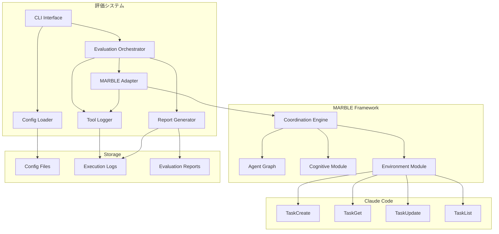
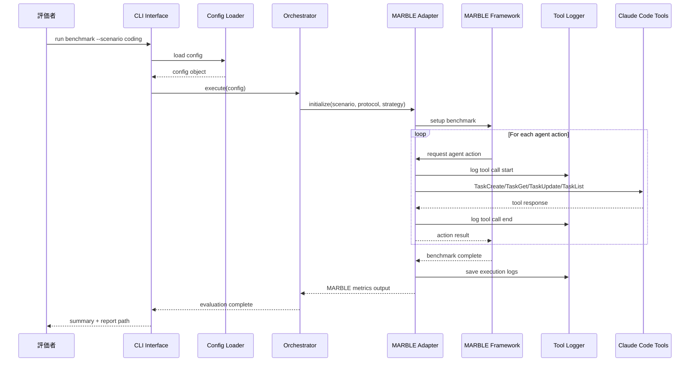
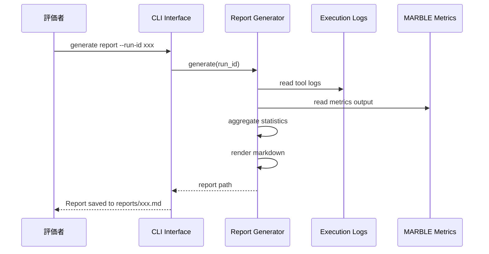
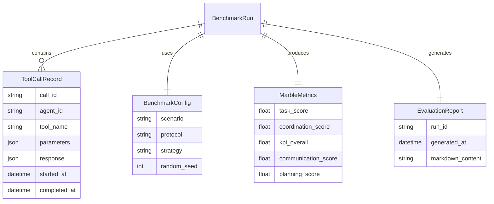

# Design Document

## Overview

**Purpose**: 本機能は、MARBLE（MultiAgentBench）フレームワークとClaude Codeのマルチエージェントオーケストレーション機能を統合し、定量的な評価基盤を提供する。

**Users**: 評価者（研究者・開発者）が、Claude Codeのタスク管理ツール（TaskCreate/TaskGet/TaskUpdate/TaskList）の協調動作性能をMARBLEベンチマークで測定するために使用する。

**Impact**: cc-mirror経由で有効化されたClaude Codeベータ機能に対し、学術的に信頼性の高いACL 2025発表のベンチマークによる客観的評価を可能にする。

### Goals
- MARBLEフレームワークとClaude Codeタスク管理ツールの統合
- Coding/Databaseシナリオでのベンチマーク実行
- MARBLEメトリクス（TS, CS, KPI）の取得と保持
- Claude Code固有のツール使用パターン分析
- 再現可能な評価レポート生成

### Non-Goals
- MARBLEメトリクス計算ロジックの独自実装（MARBLEに委譲）
- 競争タスク（Werewolf, Bargaining）の評価（協調タスクに限定）
- リアルタイムメトリクス表示（バッチ処理のみ）
- MARBLEフレームワーク自体の改修

## Architecture

### Architecture Pattern & Boundary Map



**Architecture Integration**:
- **Selected pattern**: Adapter Pattern - MARBLEとClaude Code間のインターフェース変換層を設け、疎結合を実現
- **Domain/feature boundaries**: 評価システム（統合・分析）/ MARBLE（ベンチマーク実行・メトリクス）/ Claude Code（タスク管理）の3ドメインに分離
- **Existing patterns preserved**: MARBLEのモジュラー設計を維持、Claude Codeのツールインターフェースをそのまま使用
- **New components rationale**: Adapter（MARBLE-Claude Code変換）、ToolLogger（固有分析データ収集）、Reporter（統合レポート生成）
- **Steering compliance**: ドキュメント駆動・仕様駆動の原則に従い、評価手順と環境設定を明確に記録

### Technology Stack

| Layer | Choice / Version | Role in Feature | Notes |
|-------|------------------|-----------------|-------|
| CLI | Python 3.10+ / Click | コマンドラインインターフェース | MARBLE要件に合わせてPython 3.10必須 |
| Backend / Services | Python / Poetry | 評価オーケストレーション、Adapter実装 | MARBLEと同一環境で実行 |
| Data / Storage | JSON / YAML | 設定ファイル、ログ、メトリクス出力 | MARBLEの出力フォーマットに準拠 |
| External Framework | MARBLE (MultiAgentBench) | ベンチマーク実行、メトリクス計算 | ACL 2025、Poetryで管理 |
| External Tool | cc-mirror | Claude Codeマルチエージェント有効化 | `npx cc-mirror quick` |

## System Flows

### ベンチマーク実行フロー



**Key Decisions**:
- ToolLoggerはAdapter経由のすべてのツール呼び出しをインターセプトして記録
- MARBLEのメトリクス出力はそのまま保持し、独自加工は行わない

### レポート生成フロー



## Requirements Traceability

| Requirement | Summary | Components | Interfaces | Flows |
|-------------|---------|------------|------------|-------|
| 1.1 | MARBLEインストール・設定 | ConfigLoader, MarbleAdapter | SetupService | - |
| 1.2 | cc-mirror経由のマルチエージェント有効化 | ConfigLoader | SetupService | - |
| 1.3 | タスク管理ツールのMARBLEマッピング | MarbleAdapter, ToolMapper | AgentInterface | ベンチマーク実行 |
| 1.4 | MARBLEタスク割当時のClaude Code呼び出し | MarbleAdapter | AgentInterface | ベンチマーク実行 |
| 1.5 | 統合設定不整合時のエラー処理 | ConfigLoader | ValidationResult | - |
| 2.1 | Codingシナリオ起動 | Orchestrator, MarbleAdapter | BenchmarkRunner | ベンチマーク実行 |
| 2.2 | Databaseシナリオ起動 | Orchestrator, MarbleAdapter | BenchmarkRunner | ベンチマーク実行 |
| 2.3 | 協調プロトコル選択 | ConfigLoader, Orchestrator | BenchmarkConfig | - |
| 2.4 | 計画戦略選択 | ConfigLoader, Orchestrator | BenchmarkConfig | - |
| 2.5 | MARBLE標準ログ出力保存 | ToolLogger | LogWriter | ベンチマーク実行 |
| 3.1 | Task Score取得 | MetricsCollector | MetricsOutput | レポート生成 |
| 3.2 | Coordination Score取得 | MetricsCollector | MetricsOutput | レポート生成 |
| 3.3 | Milestone KPI取得 | MetricsCollector | MetricsOutput | レポート生成 |
| 3.4 | Communication/Planning Score個別取得 | MetricsCollector | MetricsOutput | レポート生成 |
| 3.5 | MARBLEメトリクス出力フォーマット保持 | MetricsCollector | MetricsOutput | レポート生成 |
| 4.1 | TaskCreate呼び出し記録 | ToolLogger | ToolCallRecord | ベンチマーク実行 |
| 4.2 | TaskGet/TaskUpdate呼び出しパターン記録 | ToolLogger | ToolCallRecord | ベンチマーク実行 |
| 4.3 | TaskList呼び出しタイミング・結果記録 | ToolLogger | ToolCallRecord | ベンチマーク実行 |
| 4.4 | タスク依存関係使用統計集計 | ToolAnalyzer | DependencyStats | レポート生成 |
| 4.5 | エージェント間タスク割り当て分布可視化 | ReportGenerator | DistributionChart | レポート生成 |
| 5.1 | Markdown形式レポート生成 | ReportGenerator | ReportOutput | レポート生成 |
| 5.2 | MARBLEメトリクスサマリー | ReportGenerator | ReportOutput | レポート生成 |
| 5.3 | Claude Code固有分析セクション | ReportGenerator | ReportOutput | レポート生成 |
| 5.4 | 評価環境情報 | ReportGenerator | ReportOutput | レポート生成 |
| 5.5 | 協調プロトコル・計画戦略明記 | ReportGenerator | ReportOutput | レポート生成 |
| 6.1 | MARBLEバージョン・コミットハッシュ記録 | ConfigLoader | EnvironmentInfo | - |
| 6.2 | cc-mirror設定パラメータ記録 | ConfigLoader | EnvironmentInfo | - |
| 6.3 | 協調プロトコル・計画戦略の設定ファイル保存 | ConfigLoader | BenchmarkConfig | - |
| 6.4 | 同一条件での再実行 | Orchestrator | BenchmarkRunner | ベンチマーク実行 |
| 6.5 | MARBLE乱数シード設定サポート | ConfigLoader, MarbleAdapter | BenchmarkConfig | - |

## Components and Interfaces

| Component | Domain/Layer | Intent | Req Coverage | Key Dependencies | Contracts |
|-----------|--------------|--------|--------------|------------------|-----------|
| ConfigLoader | Core | 設定ファイル読み込みと検証 | 1.1, 1.2, 1.5, 2.3, 2.4, 6.1-6.5 | YAML/JSON Parser (P0) | Service |
| Orchestrator | Core | 評価フロー全体の制御 | 2.1, 2.2, 6.4 | ConfigLoader (P0), MarbleAdapter (P0) | Service |
| MarbleAdapter | Integration | MARBLEとClaude Code間のインターフェース変換 | 1.3, 1.4, 6.5 | MARBLE Framework (P0), ToolLogger (P1) | Service, API |
| ToolLogger | Analysis | Claude Codeツール呼び出しの記録 | 2.5, 4.1, 4.2, 4.3 | FileSystem (P0) | Service |
| ToolAnalyzer | Analysis | ツール使用パターンの集計・分析 | 4.4, 4.5 | ToolLogger (P0) | Service |
| MetricsCollector | Analysis | MARBLEメトリクス出力の読み取り | 3.1-3.5 | MARBLE Output (P0) | Service |
| ReportGenerator | Output | Markdown形式評価レポート生成 | 5.1-5.5 | MetricsCollector (P0), ToolAnalyzer (P0) | Service |

### Core Layer

#### ConfigLoader

| Field | Detail |
|-------|--------|
| Intent | 評価設定の読み込み、検証、環境情報の収集 |
| Requirements | 1.1, 1.2, 1.5, 2.3, 2.4, 6.1, 6.2, 6.3, 6.5 |

**Responsibilities & Constraints**
- 設定ファイル（YAML）の読み込みとスキーマ検証
- CLI引数による設定オーバーライド
- MARBLE/cc-mirror環境の検証と情報収集
- 不整合検出時のエラー報告

**Dependencies**
- Inbound: CLI — 設定パス、CLI引数 (P0)
- External: PyYAML — YAML解析 (P0)
- External: MARBLE — バージョン情報取得 (P1)

**Contracts**: Service [x]

##### Service Interface
```python
from dataclasses import dataclass
from typing import Literal
from pathlib import Path

@dataclass
class CoordinationProtocol:
    type: Literal["star", "tree", "graph", "chain"]

@dataclass
class PlanningStrategy:
    type: Literal["vanilla", "cot", "group_discussion", "cognitive"]

@dataclass
class BenchmarkConfig:
    scenario: Literal["coding", "database"]
    protocol: CoordinationProtocol
    strategy: PlanningStrategy
    random_seed: int | None
    marble_version: str
    marble_commit: str
    cc_mirror_config: dict[str, str]

@dataclass
class ValidationError:
    field: str
    message: str

@dataclass
class ValidationResult:
    valid: bool
    errors: list[ValidationError]

class ConfigLoaderService:
    def load(self, config_path: Path, cli_overrides: dict[str, str] | None = None) -> BenchmarkConfig:
        """設定ファイルを読み込み、CLI引数でオーバーライドする"""
        ...

    def validate(self, config: BenchmarkConfig) -> ValidationResult:
        """設定の整合性を検証する"""
        ...

    def collect_environment_info(self) -> dict[str, str]:
        """MARBLE/cc-mirror環境情報を収集する"""
        ...
```

**Implementation Notes**
- CLI引数は設定ファイルより優先される
- MARBLE未インストール時は明確なエラーメッセージを出力
- cc-mirror設定の検証にはサブプロセスで`npx cc-mirror`の存在確認を行う

---

#### Orchestrator

| Field | Detail |
|-------|--------|
| Intent | ベンチマーク実行フロー全体の制御と状態管理 |
| Requirements | 2.1, 2.2, 6.4 |

**Responsibilities & Constraints**
- ベンチマーク実行の開始・監視・終了処理
- エラー発生時のクリーンアップ
- 実行ログの管理とランID生成

**Dependencies**
- Inbound: CLI — BenchmarkConfig (P0)
- Outbound: MarbleAdapter — ベンチマーク実行 (P0)
- Outbound: ToolLogger — ログ記録 (P1)
- Outbound: MetricsCollector — メトリクス取得 (P1)

**Contracts**: Service [x]

##### Service Interface
```python
from dataclasses import dataclass
from pathlib import Path
from datetime import datetime

@dataclass
class RunResult:
    run_id: str
    started_at: datetime
    completed_at: datetime
    success: bool
    metrics_path: Path
    logs_path: Path
    error_message: str | None

class OrchestratorService:
    def execute(self, config: BenchmarkConfig) -> RunResult:
        """ベンチマークを実行し、結果を返す"""
        ...

    def rerun(self, run_id: str) -> RunResult:
        """過去の設定で再実行する"""
        ...

    def get_run_status(self, run_id: str) -> Literal["running", "completed", "failed", "not_found"]:
        """実行状態を取得する"""
        ...
```

---

### Integration Layer

#### MarbleAdapter

| Field | Detail |
|-------|--------|
| Intent | MARBLEフレームワークとClaude Codeタスク管理ツール間のインターフェース変換 |
| Requirements | 1.3, 1.4, 6.5 |

**統合アプローチ: 外部オーケストレーター方式（アプローチB）**

```
Evaluation System → MarbleAdapter → MARBLE (benchmark execution)
                 ↓
                 → cc-mirror → Claude Code (Task Tools)
```

- MARBLEをブラックボックスとして使用し、コード変更不要
- MarbleAdapterがMARBLEとClaude Codeを橋渡し
- cc-mirrorの分離環境（`~/.cc-mirror/`）を活用
- 保守性が高く、MARBLEバージョンアップの影響を最小化

**前提条件: cc-mirror Team Mode**

Claude Codeのタスク管理ツール（TaskCreate/TaskGet/TaskUpdate/TaskList）は**cc-mirror Team Mode**により有効化される:
- cc-mirrorは`~/.cc-mirror/`配下に分離されたClaude Codeインスタンスを作成
- Team Modeには**orchestrator skill**も含まれ、マルチエージェント協調パターンを教示
- 有効化方法: `npx cc-mirror --enable-team-mode` または `--provider mirror`（デフォルトでTeam Mode有効）

**Responsibilities & Constraints**
- MARBLEのAgent InterfaceをClaude Codeツール呼び出しに変換
- Claude Codeツールレスポンスを MARBLEフォーマットに変換
- 協調プロトコルに応じたblocks/blockedBy構造の構築
- 乱数シード設定のMARBLEへの伝達
- cc-mirror子プロセスの起動・管理

**Dependencies**
- Inbound: Orchestrator — BenchmarkConfig (P0)
- Outbound: MARBLE Framework — ベンチマーク実行 (P0)
- Outbound: cc-mirror — Claude Code Task Tools呼び出し (P0)
- Outbound: ToolLogger — ツール呼び出し記録 (P1)
- External: MARBLE — Agent Interface (P0)

**Contracts**: Service [x] / API [x]

##### Service Interface
```python
from dataclasses import dataclass
from typing import Any, Literal
from pathlib import Path
from datetime import datetime

@dataclass
class AgentAction:
    agent_id: str
    action_type: Literal["task_create", "task_get", "task_update", "task_list"]
    parameters: dict[str, Any]
    timestamp: datetime

@dataclass
class AgentActionResult:
    success: bool
    response: dict[str, Any]
    error: str | None

class MarbleAdapterService:
    def initialize(self, config: BenchmarkConfig) -> None:
        """MARBLEベンチマークとcc-mirror環境を初期化する"""
        ...

    def run_benchmark(self) -> Path:
        """ベンチマークを実行し、メトリクス出力パスを返す"""
        ...

    def translate_to_claude_tool(self, action: AgentAction) -> dict[str, Any]:
        """MARBLEアクションをClaude Codeツール呼び出しに変換する"""
        ...

    def translate_from_claude_tool(self, response: dict[str, Any]) -> AgentActionResult:
        """Claude Codeツールレスポンスをエージェントアクション結果に変換する"""
        ...

    def build_dependency_structure(self, protocol: CoordinationProtocol, agents: list[str]) -> list[dict]:
        """協調プロトコルに基づくblocks/blockedBy構造を構築する"""
        ...
```

##### API Contract (Tool Mapping)

| MARBLE Action | Claude Code Tool | Request Mapping | Response Mapping |
|---------------|-----------------|-----------------|------------------|
| create_task | TaskCreate | {subject, description} | {task_id, status} |
| get_task | TaskGet | {task_id} | {task details, comments, blocks, blockedBy} |
| update_task | TaskUpdate | {task_id, status?, comment?, blocks?, blockedBy?} | {success, updated_task} |
| list_tasks | TaskList | {} | {tasks[]} |

##### 協調プロトコル ↔ blocks/blockedBy マッピング

| MARBLEプロトコル | 構造 | blocks/blockedBy パターン |
|-----------------|------|--------------------------|
| **Star** | 1プランナー → N アクター | プランナータスクが全アクタータスクをblocks（アクターはプランナー完了を待つ） |
| **Tree** | 階層的委譲 | 親タスクが子タスクをblocks、子タスクの完了が親の次フェーズをunblock |
| **Chain** | 順次実行 | 各タスクが次タスクをblocks（`T1 blocks T2 blocks T3 ...`） |
| **Graph-Mesh** | 相互接続 | 複数のblocks/blockedBy関係、並行実行可能なタスクは依存関係なし |

**Claude Code Task Toolsの協調プロトコル別使用パターン**:
- `TaskCreate`: MARBLEがエージェントにタスク割り当て時に呼び出し
- `TaskUpdate(addBlocks/addBlockedBy)`: 協調プロトコルに応じた依存関係設定
- `TaskGet`: エージェントが自身の担当タスクと依存関係を確認
- `TaskList`: 全体の進捗とブロック状況を監視

**プロトコル別blocks/blockedBy使用特性**:
- **Star**: 少数のblocks関係（プランナー→アクター、1:N構造）
- **Chain**: 線形のblocks関係（N-1個の依存関係）
- **Tree/Graph**: 複雑なblocks/blockedByネットワーク（多対多）

**Implementation Notes**
- MARBLEのAgent Graphノードはタスクにマッピング、エッジはblocks/blockedByに変換
- cc-mirrorを子プロセスとして起動し、標準入出力でやり取り
- すべてのツール呼び出しはToolLoggerに記録後に実行
- Claude Codeへのプロンプトで協調プロトコル構造を明示的に伝達
- MARBLEの内部APIに依存するため、バージョン固定を推奨

---

### Analysis Layer

#### ToolLogger

| Field | Detail |
|-------|--------|
| Intent | Claude Codeタスク管理ツールの呼び出しを詳細に記録 |
| Requirements | 2.5, 4.1, 4.2, 4.3 |

**Responsibilities & Constraints**
- ツール呼び出しの開始・終了タイミング記録
- 引数・レスポンスの完全な記録
- 構造化ログフォーマットでの永続化

**Dependencies**
- Inbound: MarbleAdapter — ツール呼び出しイベント (P0)
- Outbound: FileSystem — ログファイル書き込み (P0)

**Contracts**: Service [x]

##### Service Interface
```python
from dataclasses import dataclass
from datetime import datetime
from typing import Any
from pathlib import Path

@dataclass
class ToolCallRecord:
    call_id: str
    agent_id: str
    tool_name: Literal["TaskCreate", "TaskGet", "TaskUpdate", "TaskList"]
    parameters: dict[str, Any]
    response: dict[str, Any] | None
    started_at: datetime
    completed_at: datetime | None
    success: bool
    error: str | None

class ToolLoggerService:
    def log_call_start(self, agent_id: str, tool_name: str, parameters: dict[str, Any]) -> str:
        """ツール呼び出し開始を記録し、call_idを返す"""
        ...

    def log_call_end(self, call_id: str, response: dict[str, Any] | None, success: bool, error: str | None = None) -> None:
        """ツール呼び出し終了を記録する"""
        ...

    def save(self, output_path: Path) -> None:
        """ログをファイルに保存する"""
        ...

    def get_records(self) -> list[ToolCallRecord]:
        """記録されたすべてのツール呼び出しを取得する"""
        ...
```

---

#### ToolAnalyzer

| Field | Detail |
|-------|--------|
| Intent | ツール使用パターンの集計・分析 |
| Requirements | 4.4, 4.5 |

**Responsibilities & Constraints**
- タスク依存関係（blocks/blockedBy）の使用統計集計
- エージェント間タスク割り当て分布の計算

**Dependencies**
- Inbound: ToolLogger — ToolCallRecords (P0)

**Contracts**: Service [x]

##### Service Interface
```python
from dataclasses import dataclass

@dataclass
class DependencyStats:
    total_blocks_used: int
    total_blocked_by_used: int
    avg_dependencies_per_task: float
    max_dependency_depth: int

@dataclass
class TaskDistribution:
    agent_id: str
    tasks_created: int
    tasks_updated: int
    tasks_completed: int

class ToolAnalyzerService:
    def analyze_dependencies(self, records: list[ToolCallRecord]) -> DependencyStats:
        """タスク依存関係の使用統計を分析する"""
        ...

    def analyze_distribution(self, records: list[ToolCallRecord]) -> list[TaskDistribution]:
        """エージェント間のタスク割り当て分布を分析する"""
        ...
```

---

#### MetricsCollector

| Field | Detail |
|-------|--------|
| Intent | MARBLEメトリクス出力の読み取りと構造化 |
| Requirements | 3.1, 3.2, 3.3, 3.4, 3.5 |

**Responsibilities & Constraints**
- MARBLEの出力ファイルからメトリクスを抽出
- 出力フォーマットをそのまま保持（変換しない）
- 欠損値・フォーマットエラーの検出

**Dependencies**
- Inbound: MARBLE Output — メトリクスファイル (P0)

**Contracts**: Service [x]

##### Service Interface
```python
from dataclasses import dataclass
from pathlib import Path

@dataclass
class MarbleMetrics:
    task_score: float
    coordination_score: float
    kpi_overall: float
    communication_score: float
    planning_score: float
    raw_output: dict[str, Any]  # 元のMARBLE出力をそのまま保持

class MetricsCollectorService:
    def collect(self, metrics_path: Path) -> MarbleMetrics:
        """MARBLEメトリクス出力を読み取る"""
        ...

    def validate_format(self, metrics_path: Path) -> ValidationResult:
        """メトリクス出力フォーマットを検証する"""
        ...
```

---

### Output Layer

#### ReportGenerator

| Field | Detail |
|-------|--------|
| Intent | Markdown形式の評価レポート生成 |
| Requirements | 5.1, 5.2, 5.3, 5.4, 5.5 |

**Responsibilities & Constraints**
- MARBLEメトリクスとClaude Code固有分析の統合
- Markdown形式でのレンダリング
- 評価環境情報の記録

**Dependencies**
- Inbound: MetricsCollector — MarbleMetrics (P0)
- Inbound: ToolAnalyzer — DependencyStats, TaskDistribution (P0)
- Inbound: ConfigLoader — EnvironmentInfo (P1)

**Contracts**: Service [x]

##### Service Interface
```python
from dataclasses import dataclass
from pathlib import Path

@dataclass
class ReportConfig:
    run_id: str
    output_path: Path
    include_raw_logs: bool

class ReportGeneratorService:
    def generate(
        self,
        config: ReportConfig,
        metrics: MarbleMetrics,
        dependency_stats: DependencyStats,
        distribution: list[TaskDistribution],
        environment_info: dict[str, str]
    ) -> Path:
        """評価レポートを生成し、出力パスを返す"""
        ...
```

**Implementation Notes**
- レポートテンプレートはJinja2等のテンプレートエンジンを使用
- タスク割り当て分布はMermaidのpie chartで可視化

## Data Models

### Domain Model



**Business Rules & Invariants**:
- BenchmarkRunは常に1つのBenchmarkConfigを持つ
- ToolCallRecordのstarted_atはcompleted_at以前でなければならない
- MarbleMetricsのスコアはすべて0.0〜1.0（または0〜100）の範囲

### Logical Data Model

**設定ファイル構造** (`config.yaml`):
```yaml
scenario: coding  # coding | database
protocol: star    # star | tree | graph | chain
strategy: vanilla # vanilla | cot | group_discussion | cognitive
random_seed: 42   # optional
cc_mirror:
  provider: mirror
  name: mclaude
marble:
  version_constraint: ">=1.0.0"
```

**ログファイル構造** (`logs/{run_id}/tool_calls.jsonl`):
```json
{"call_id": "...", "agent_id": "...", "tool_name": "TaskCreate", "parameters": {...}, "started_at": "..."}
{"call_id": "...", "response": {...}, "completed_at": "...", "success": true}
```

**メトリクス出力** (`logs/{run_id}/marble_metrics.json`):
- MARBLEのネイティブ出力フォーマットをそのまま保存

## Error Handling

### Error Strategy
- 設定エラー: 早期検証で明確なエラーメッセージを出力し終了
- MARBLE実行エラー: ログを保存し、部分結果があれば記録
- ツール呼び出しエラー: リトライ（最大3回）後、エラーをログに記録して継続

### Error Categories and Responses

**User Errors (設定エラー)**:
- 無効なシナリオ/プロトコル/戦略指定 → 有効な値の一覧を提示
- 設定ファイル不存在 → パス確認を促すメッセージ
- MARBLE未インストール → インストール手順を提示

**System Errors (実行時エラー)**:
- MARBLE実行失敗 → ログ保存、エラー内容を報告
- ツール呼び出しタイムアウト → リトライ後、スキップして継続

**Business Logic Errors**:
- 統合設定不整合（1.5）→ 不整合の詳細と修正方法を提示

## Testing Strategy

### Unit Tests
- ConfigLoader: 設定ファイルパース、検証ロジック、CLI引数オーバーライド
- ToolLogger: ログ記録、タイムスタンプ、JSONLシリアライズ
- ToolAnalyzer: 依存関係統計計算、分布計算
- MetricsCollector: MARBLEメトリクス抽出、フォーマット検証

### Integration Tests
- MarbleAdapter + MARBLE: ベンチマーク初期化、ツールマッピング
- Orchestrator + MarbleAdapter + ToolLogger: 完全な実行フロー
- ReportGenerator + MetricsCollector + ToolAnalyzer: レポート生成

### E2E Tests
- Codingシナリオでのフルベンチマーク実行
- Databaseシナリオでのフルベンチマーク実行
- 同一設定での再実行による再現性検証

## Optional Sections

### Performance & Scalability
- ベンチマーク実行時間は主にMARBLE側で決定されるため、本システムのオーバーヘッドは最小化
- ログ書き込みは非同期化を検討（大量のツール呼び出し時）
- メモリ使用量: ToolCallRecordsは実行中メモリ保持、完了後にファイル保存

### Security Considerations
- 設定ファイルにAPIキーを含めない（環境変数経由）
- ログファイルにはツール引数が含まれるため、機密情報が含まれないか確認

## Supporting References

詳細な調査結果は `research.md` を参照:
- MARBLEアーキテクチャ詳細
- 協調プロトコル・計画戦略の詳細
- 評価メトリクスの計算式
- Claude Codeタスク管理ツールの仕様
